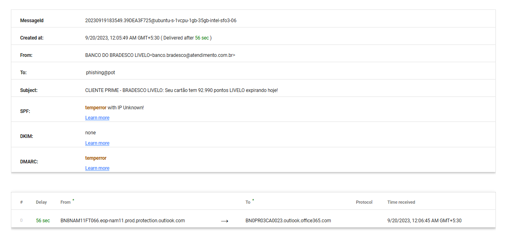

# 🛡️ CyberSecurity Internship - Task 2: Phishing Email Analysis

## 🌟 Objective  
Analyze a phishing email sample and identify characteristics that indicate a phishing attempt.

---

## 🛠 Tools Used  
- Email client or raw `.eml` viewer  
- Online email header analyzer (e.g., MXToolbox, Google Admin Toolbox)  
- Text editor (for viewing source content)  

---

## 📥 Sample Email Files  
- `phishing_email_sample.eml`: Raw phishing email file  
- `phishing_email_sample.html`: Rendered email preview  
- `header-analysis-result.png`: Screenshot of header analysis  

---

## 🔍 Phishing Indicators Found  

| Indicator                         | Description |
|----------------------------------|-------------|
| 🧑‍💻 Spoofed Sender Email        | Appears from "Banco Bradesco" but uses a suspicious domain. |
| 📬 Header Anomalies              | Missing or failed SPF/DKIM/DMARC validation. |
| 🌐 Mismatched Links              | Visible link text differs from actual malicious URL. |
| ⚠️ Urgent Call to Action         | Message pressures user with statements like "points expire today." |
| ✍️ Grammar & Spelling Issues     | Example: "spe ling", poor sentence construction. |
| 📎 No Legitimate Attachments     | No proper documents; links redirect to unknown sites. |

---

## 📑 Summary  
This phishing email pretends to be from Bradesco Bank and tries to lure the user into clicking a malicious link by creating urgency around reward point expiration. The sender domain, headers, and language used all indicate a phishing attempt.  

A full list of identified phishing characteristics is available in `phishing_analysis_report.md`.

---

## 📚 Learnings  
- How to identify spoofed senders and mismatched URLs  
- Use of online tools to analyze email headers  
- Phishing traits like urgency, fake branding, and social engineering  
- Hands-on experience working with `.eml` phishing samples  

---

## 🗂 Screenshots  

---

## 📁 Files in This Repo

| File                    | Description                         |
|-------------------------|-------------------------------------|
| phishing_sample.eml     | Original email used for analysis    |
| decoded_email.html      | Visual representation of the email |
| email_headers.txt       | Raw headers extracted from the email |
| phishing_analysis_report.md | Detailed phishing indicators report |
| header-analysis-result.png | Screenshot of header analysis      |
| README.md               | This documentation                  |

---

## 🔗 References  
- [Google Admin Toolbox Header Analyzer](https://toolbox.googleapps.com/apps/messageheader/)  
- [MXToolbox Email Header Analyzer](https://mxtoolbox.com/EmailHeaders.aspx)  
- [Phishing Awareness](https://www.phishing.org/what-is-phishing)

